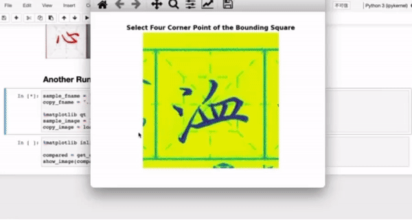

## 使用方法:

1. 安装Anaconda3
2. 打开`CompareCalligraphy.ipynb`，更改`sample_fname`, `copy_fname` 变量名，指向示例和自己的字文件名
3. 根据提示点取米字格周边四点
4. 可视化图片

提示: 请善用Mac的「接續互通相機」功能。方法如下：
* 在excercises文件夹右键，`import from iphone or ipad` -> `take photo`
* 打开手机，此时应自动弹出相机窗口，双手变焦，对准想要比较的米字格，尽量保存并只保存一点周围边框
* 重命名文件，即可使用

***本项目纯纯为了自用创建，不予商用，侵权必究！***
 请联系: yiyou_lin@hotmail.com
